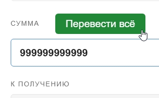

# SendAllMoneyOnFunPay
Добавляет кнопку "ПЕРЕВЕСТИ ВСЁ" на сайте FunPay.com

<p align="center">
    
    
</p>


## Sourse code
```bat
// ==UserScript==
// @name         FunPay - Перевести всё
// @namespace    https://github.com/
// @version      1.3
// @description  Добавляет кнопку "Перевести всё" + правильный триггер комиссии
// @author       Grok
// @match        https://funpay.com/account/balance*
// @grant        none
// @run-at       document-end
// ==/UserScript==

(function () {
    'use strict';

    function getBalance() {
        const balanceEl = document.querySelector('.payment-value');
        if (!balanceEl) return 0;

        const text = balanceEl.textContent.trim();
        const match = text.match(/([\d\s.,]+)/);
        if (!match) return 0;

        const numStr = match[1].replace(/\s/g, '').replace(',', '.');
        return parseFloat(numStr) || 0;
    }

    function setValueLikeHuman(input, value) {
    if (!input) return;

    const strValue = value.toFixed(2).replace('.', ',');

    // Очищаем поле
    input.focus();
    input.select();
    document.execCommand('delete');   // или input.value = '';

    // Вводим посимвольно с небольшой задержкой
    let i = 0;
    const typeInterval = setInterval(() => {
        if (i < strValue.length) {
            const char = strValue[i];
            input.value += char;

            // Триггерим события после каждой цифры
            ['input', 'keyup', 'change'].forEach(ev => {
                input.dispatchEvent(new Event(ev, { bubbles: true }));
            });

            i++;
        } else {
            clearInterval(typeInterval);
            // Финальные события
            ['change', 'blur', 'input'].forEach(ev => {
                input.dispatchEvent(new Event(ev, { bubbles: true }));
            });
            console.log(`[FunPay] Посимвольно вставлено: ${strValue}`);
        }
    }, 30); // 30мс между символами — выглядит очень естественно
}

    function addButton() {
        if (document.getElementById('funpay-transfer-all')) return;

        const formGroup = document.querySelector('.form-group.has-feedback');
        if (!formGroup) return;

        const input = formGroup.querySelector('input[name="amount_int"]');
        if (!input) return;

        const btn = document.createElement('button');
        btn.id = 'funpay-transfer-all';
        btn.type = 'button';
        btn.textContent = 'Перевести всё';
        btn.style.marginLeft = '10px';
        btn.style.padding = '7px 14px';
        btn.style.backgroundColor = '#28a745';
        btn.style.color = 'white';
        btn.style.border = 'none';
        btn.style.borderRadius = '4px';
        btn.style.cursor = 'pointer';
        btn.style.fontSize = '14px';

        btn.onmouseover = () => btn.style.backgroundColor = '#218838';
        btn.onmouseout = () => btn.style.backgroundColor = '#28a745';

        // Размещаем кнопку
        const label = formGroup.querySelector('label');
        if (label) {
            label.style.display = 'flex';
            label.style.alignItems = 'center';
            label.style.gap = '12px';
            label.appendChild(btn);
        } else {
            formGroup.appendChild(btn);
        }

        btn.addEventListener('click', () => {
            const balance = getBalance();

            if (balance <= 0) {
                alert('Не удалось прочитать баланс');
                return;
            }

            setValueLikeHuman(input, balance);

            console.log(`[FunPay Transfer All] Вставлено: ${balance.toFixed(2).replace('.', ',')} ₽`);
        });
    }

    // Запуск
    function init() {
        setTimeout(addButton, 600);   // небольшая задержка, чтобы форма точно загрузилась
    }

    init();

    // Наблюдатель на случай появления формы позже
    const observer = new MutationObserver(() => {
        if (!document.getElementById('funpay-transfer-all')) {
            addButton();
        }
    });

    observer.observe(document.body, { childList: true, subtree: true });

})();
```

## Video
https://www.youtube.com/watch?v=awLs17pffNk

## Repo
https://github.com/gitalexhubuser/SendAllMoneyOnFunPay
